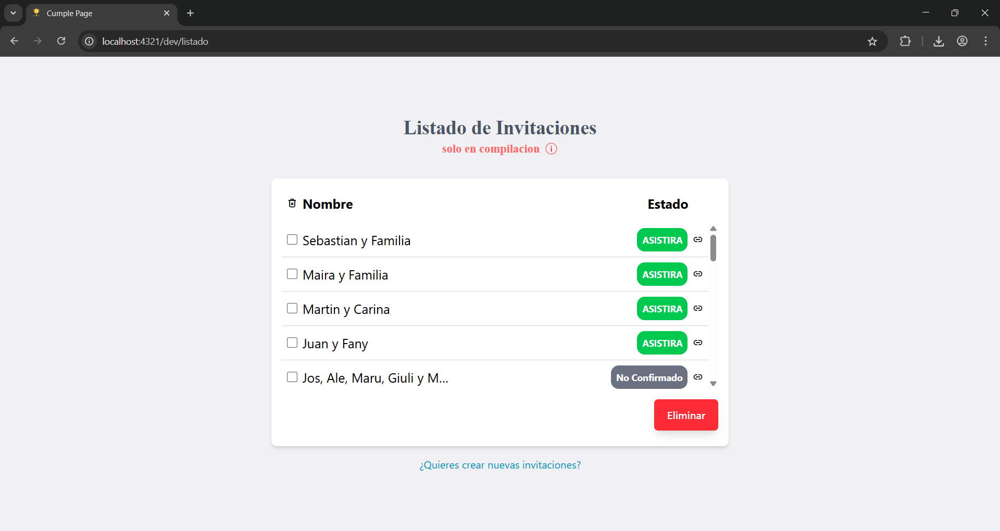
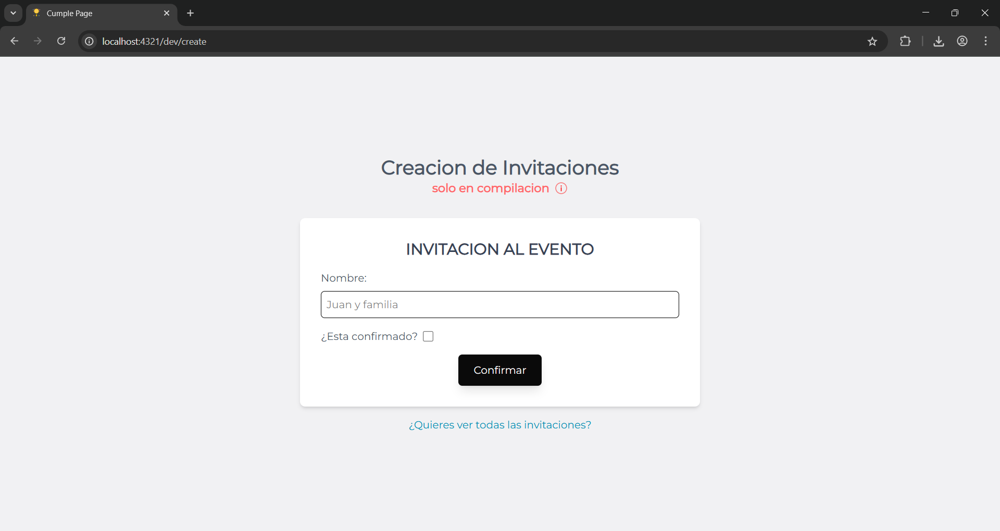

# CREADOR DE INVITACIONES PARA EVENTOS
<div style="display: flex; gap:2px">
<a href="https://astro.build/">
  
</a>
<a href="https://nodesource.com/products/nsolid">
  
</a>
</div>

## Acerca de
Este proyecto está diseñado para la creación de páginas de eventos, permitiendo la confirmación de asistencia por parte de los invitados.
## Capturas de pantalla
<div style="display:flex; width:100%; justify-content: space-around;">


</div>
 
 

## Instalacion
Iniciar la API

```
/
├── api/
│   └── index.js
```
Necesitaras un .env con las creedenciales
```.env
{
	PORT="3000"
	DB_URL="localhost"
	DB_USER="root"
	DB_PASSWORD="1234"
	DB_NAME="invitaciones"
}
```
Despues inicias el servidor en modo de desarrollo. En la raiz del proyecto:
```sh
npm run dev
```
El servidor necesita un .env con las creedenciales
```.env
{
	API_URL="http://localhost:3000"
	PUBLIC_API_URL="http://localhost:3000"
}
```
y luego vas a la ruta http://localhost:4321/dev/create. Una vez creas las invitaciones debes renombrar la carpeta /page/dev a /page/_dev/ para que al momento de hacer
```sh
npm run build
```
No tener disponible las paginas de desarrollo.
<BR>
_ Inspirado en [INVITO](https://invitio.events/) _
